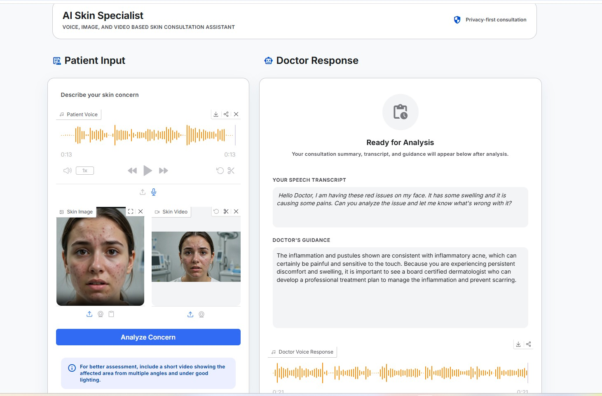
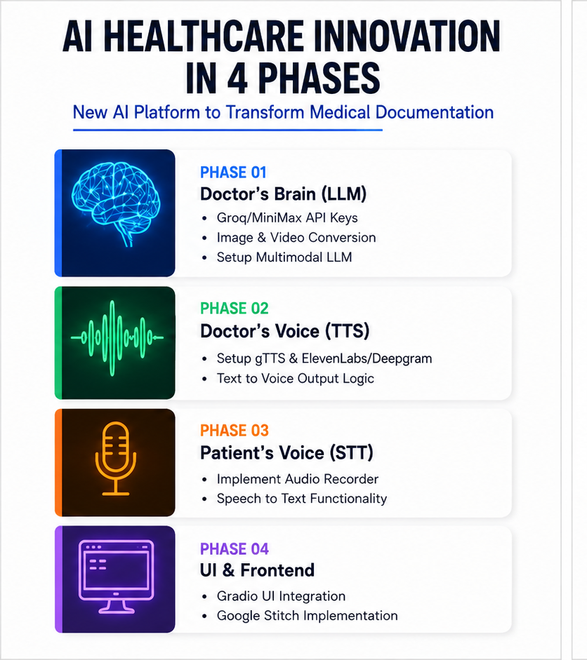
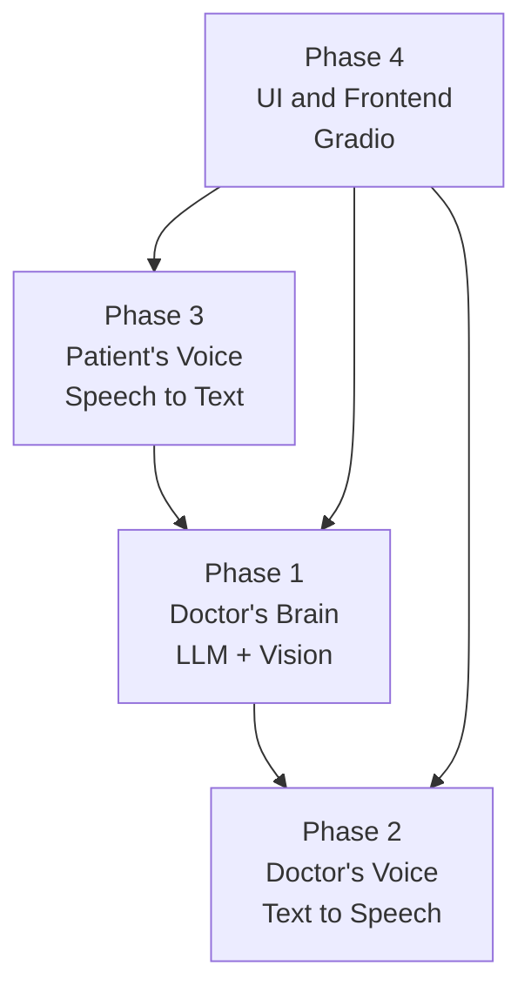
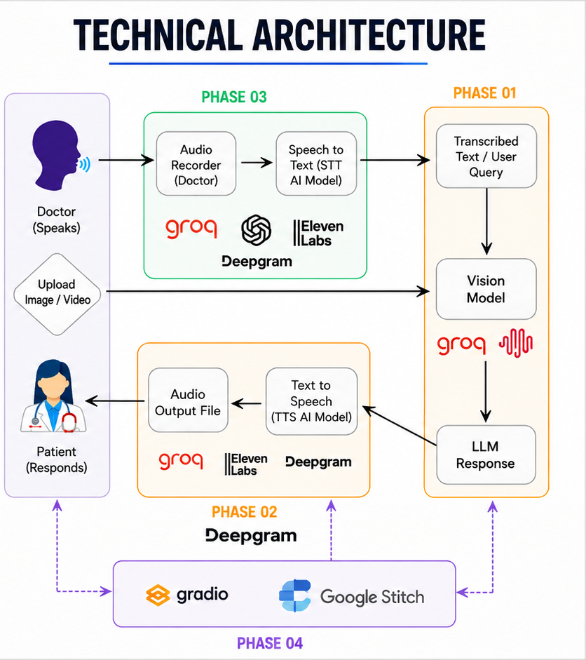
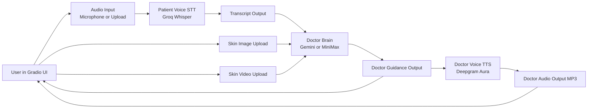

# AI-Skin-Specialist

AI Skin Specialist is a multimodal medical-assistant prototype that combines:

1. Patient voice input (STT)
2. Skin image and video analysis (Vision + LLM)
3. Doctor-style text response
4. Doctor voice response (TTS)
5. Gradio-based frontend workflow

## Project Screenshots

### Live App UI

## Project Implementation Phases

This project is implemented in four phases.

### Implementation Phases Photo

1. Phase 1: Doctor's Brain (LLM + Vision)
	- Core files: brain_of_the_doctor_groq.py, brain_of_the_doctor_minimax.py
	- Responsibility: analyze patient context, skin image, and video to generate medical guidance
	- Models: Gemini, MiniMax (optional path)

2. Phase 2: Doctor's Voice (TTS)
	- Core file: voice_of_the_doctor.py
	- Responsibility: convert doctor guidance text into spoken response audio
	- Provider: Deepgram Aura voice model

3. Phase 3: Patient's Voice (STT)
	- Core file: voice_of_the_patient.py
	- Responsibility: capture microphone input and transcribe speech to text
	- Provider: Groq Whisper transcription API

4. Phase 4: UI and Frontend
	- Core file: main.py
	- Responsibility: orchestrate the full user journey in Gradio
	- UI work: Gradio layout, styling, input/output binding, and Google Stitch design handoff assets

### Implementation Phase Diagram

## Technical Architecture

### Technical Architecture Photo

### End-to-End Flow

1. User records or uploads patient voice in the UI
2. STT module transcribes the audio into text
3. User uploads skin photo and optionally video
4. Doctor brain receives transcript + image + video context
5. LLM/vision model generates doctor guidance text
6. TTS converts guidance text into doctor audio output
7. UI shows transcript, guidance, and playable voice response

### Technical Architecture Diagram

## Technologies Used Step by Step

1. Frontend and orchestration
	- Gradio for UI blocks, inputs, outputs, and workflow wiring
	- Google Stitch for UI design architecture and implementation-phase visualization assets
	- Python 3.13 runtime

2. Audio capture and local processing
	- SpeechRecognition for microphone capture
	- PyAudio and PortAudio for microphone device access
	- pydub + ffmpeg for audio conversion/export

3. Speech-to-text pipeline
	- Groq API for audio transcription
	- Whisper model configured through WHISPER_MODEL

4. Multimodal doctor reasoning
	- Google GenAI SDK for Gemini requests
	- Video upload plus processing polling before analysis
	- PIL/Pillow for image resizing and preprocessing
	- Optional MiniMax integration through Anthropic-compatible endpoint

5. Text-to-speech response
	- Deepgram SDK for doctor response audio generation

6. Configuration and secret management
	- python-dotenv for environment variables
	- .env local secrets, sample.env template, .gitignore protection

## Paid and Unpaid Model Options

| Stage | Provider / Model | Type | Status in Project | Notes |
|---|---|---|---|---|
| Patient STT | Groq Whisper | Paid or limited free tier | Active | Used in voice_of_the_patient.py |
| Doctor Brain | Gemini (gemini-3.1-flash-lite by default) | Paid or limited free tier | Active | Used in brain_of_the_doctor_groq.py |
| Doctor Brain (alternate) | MiniMax-M3 | Paid | Optional path | Used in brain_of_the_doctor_minimax.py |
| Doctor TTS | Deepgram Aura | Paid or trial credits | Active | Used in voice_of_the_doctor.py |

### Current Default Model Path in This Project

1. STT: Groq Whisper
2. Multimodal reasoning: Gemini (video and optional image)
3. TTS: Deepgram Aura

### Free/Low-Cost Alternatives (Optional)

1. STT: local Whisper (faster-whisper) on your own machine
2. Vision/LLM: open-source VLMs (for example Qwen-VL class models) with local GPU
3. TTS: Coqui TTS or Piper for fully local synthesis

## Security: Keep API Keys Safe Before Pushing to GitHub

1. Copy sample.env to .env
2. Put real keys only in .env
3. Never hardcode keys in Python files
4. Keep sample.env as an empty template only

This repository ignores .env and local secret env variants via .gitignore so keys remain local.

## Environment Variables

Populate these in .env:

1. GEMINI_API_KEY
2. GROQ_API_KEY
3. DEEPGRAM_API_KEY
4. MINIMAX_API_KEY (only if using MiniMax path)
5. GEMINI_MODEL (optional)
6. WHISPER_MODEL (optional)
7. MINIMAX_MODEL (optional)
8. MINIMAX_BASE_URL (optional)

## Running the App

1. Prerequisites
	- Python 3.13+
	- uv package manager
	- ffmpeg installed locally
	- PortAudio available (required by PyAudio)

2. Install dependencies
	- uv sync

3. Create local environment file
	- Copy sample.env to .env
	- Add your API keys in .env

4. Run the app
	- uv run main.py

5. Open local URL shown in terminal (Gradio)

6. Test full pipeline
	- Upload or record patient voice
	- Upload skin image
	- Upload skin video
	- Click Analyze Concern

## Deploy to Hugging Face Spaces

1. Push this repository to your Space repository URL
2. In Space Settings, add secrets for:
	- GEMINI_API_KEY
	- GROQ_API_KEY
	- DEEPGRAM_API_KEY
	- MINIMAX_API_KEY (optional)
3. Space build will use:
	- app.py as entrypoint
	- requirements.txt for Python dependencies
	- packages.txt for system packages

## Local Troubleshooting

1. ffmpeg warning in pydub
	- Set FFMPEG_BINARY in .env to your ffmpeg.exe full path

2. Microphone not detected
	- Verify PortAudio and PyAudio installation

3. No doctor audio output
	- Ensure DEEPGRAM_API_KEY is valid in .env

4. Video processing delay
	- Wait for upload processing to complete, or try a shorter clip